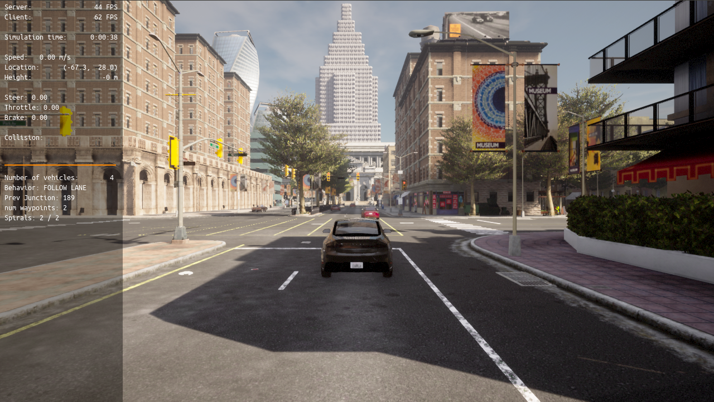
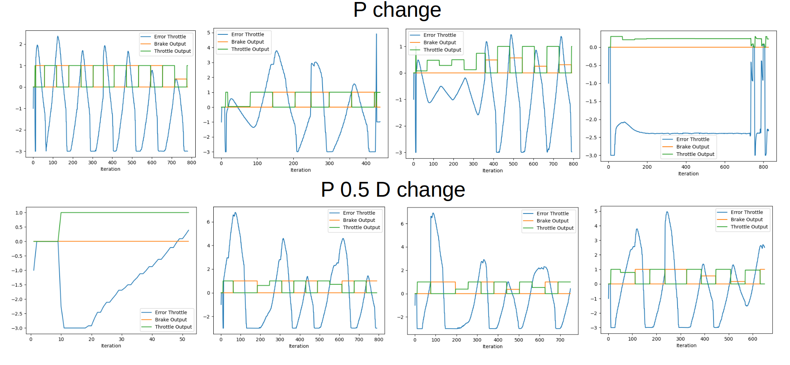
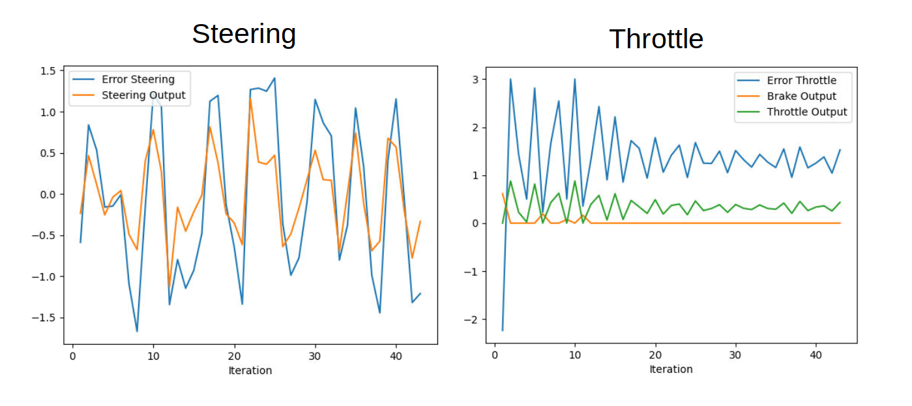

# Control and Trajectory Tracking for Autonomous Vehicle
# Proportional-Integral-Derivative (PID)

## Installation and Running Code

Run the following commands to install the starter code in the Udacity Workspace:

Clone the <a href="https://github.com/udacity/nd013-c6-control-starter/tree/master" target="_blank">repository</a>:

`git clone https://github.com/udacity/nd013-c6-control-starter.git`

### Run Carla Simulator

Open new window

* `su - student`
// Will say permission denied, ignore and continue
* `cd /opt/carla-simulator/`
* `SDL_VIDEODRIVER=offscreen ./CarlaUE4.sh -opengl`

I am using different version of cuda than the workspace environment, so SDL_VIDEODRIVER=offscreen does not work. In addition, opengl is no longer supported for my version of Unreal Engine so Vulkan is used. So for my environment I omit those options:

* `./CarlaUE4.sh`

### Compile and Run the Controller

Open new window

* `cd nd013-c6-control-starter/project`
* `./install-ubuntu.sh`
* `cd pid_controller/`
* `rm -rf rpclib`
* `git clone https://github.com/rpclib/rpclib.git`
* `cmake .`
* `make` (This last command compiles your c++ code, run it after every change in your code)

### Testing

To test your installation run the following commands.

* `cd nd013-c6-control-starter/project`
* `./run_main_pid.sh`
This will silently fail `ctrl + C` to stop
* `./run_main_pid.sh` (again)
Go to desktop mode to see CARLA

If error bind is already in use, or address already being used

* `ps -aux | grep carla`
* `kill id`

For my local enviornment, I can simply ctrl + c to exit.

## Project Writeup


### Step 1: Build the PID controller object
For step 1, the files to be changed are [pid_controller.h](https://github.com/mgmike/nd013-c6-control-starter/tree/master/project/pid_controller/pid_controller.h) and [pid_controller.cpp](https://github.com/mgmike/nd013-c6-control-starter/tree/master/project/pid_controller/pid_controller.cpp).

First the PID controller object was completed. The UpdateError function updates the PID errors and the total error. The TotalError function returns the total error in the provided interval. To test if the program compiles, the simulater and code was ran locally. It can be seen below that Carla runs fine and the code executes without errors but the map is different than in the provided project workspace. I am using a newer version of Carla locally so the default map is different. 


Carla runs

### Steps 2 and 3: PID controller for throttle and steer:
The [main.cpp](https://github.com/mgmike/nd013-c6-control-starter/tree/master/project/pid_controller/main.cpp), file was edited to complete steps 2 and 3.

To calculate the throttle error, the difference between the current velocty and the velocity the vehicle should be traveling at calculated by the planner is found.

Calculating the error for steering is more involved than velocity because although the actual yaw is given, the expected yaw must be calculated. The expected yaw will be the angle between the vehicle's current position and the closest waypoint. The provided function angle_between_points is used.

### Step 4: Evaluate the PID efficiency
The values of the error and the pid command are saved in thottle_data.txt and steer_data.txt.
Plot the saved values using the command (in nd013-c6-control-refresh/project):

```
python3 plot_pid.py
```

You might need to install a few additional python modules: 

```
pip3 install pandas
pip3 install matplotlib
```

I edited c++ code to accept input parameters so I could change the PID weights without re-compiling. 
To tune the parameters, I started with just proportional for speed. My progresssion of weights is as follows, 5.0, 1.0, 0.5, 0.1 and I start with proportional weight, then add differential weight and follow with integral weight. This requires a lot of manual changes though, and the resulting plots are inconsistant when running on my local machine. I believe this is due to the change in map as the path waypoints greatly increase in distance as the vehicle gets more lost. 



Eventually I figured it would be best to try on the workspace enviornment, but I did not want to re-do all the weight changes again. I took a look at the questions posted by other students to get closer to ideal. My results are below. 



Each part of PID is important. Proportional weight is typically the most influential as is the adjustment proportional to the cross track error. Just using P will cause oscillations so the derivative control uses slope of the error to smooth the curve and approach the expected value. The integral controller will reduce any bias in the long run by using the total error.

The pros of a model free controller are:
- It is less resource intensive
- Faster and easier to train
The cons are:
- Only tuned for the simulator vehicle and must be tuned again for each vehicle (Non generic)


To automatically tune the parameters, I implemented a twiddle optimization algorithm. To do this, a few things were done:
- Change the map
    - This was easy, just added client.load_world('Town03') to initial game loop
- Create a loop to generate the ego vehicle then remove it after a few seconds. 
    - To do this, I had to learn about spawning actors
    - The newly spawned vehicle spawns where the old destroyed vehicle was, this was fixed a few points below
- Edit the python code to send a flag indicating a vehicle reset
    - Easy fix, just added a sim_time check for 10 seconds the game_loop then send restart = true in the json
- Receive the flag in the C++ code
    - Easy as well, just added a check for the json restart key
- Use the total error for steering and throttle to update parameters using twiddle
    - Had to add and change a few variables in the pid_controller cpp and header files
- Make vehicle reset to default spawn location
    - I had to call world.destroy before setting world.player = None
- Set beginning point of spirals to the vehicle. They kind of just drive off.
    - To do this, I had to set way_points to []
- Save K and D values and update if they are in a file.
    - Added a new file pid_weights.txt
    - After every twiddle call, add weights and differences to file saving progress
    - Uses last line to update weights at the very start of the c++ code to resume saved progress
- Set the goal velocity to a constant value. It is using the generated spirals now.

I had to alter the twiddle algorithm discribed in the lesson because twiddle calls a function to run the simulation. The implementation of twiddle in my code is the opposite as the twiddle function is called to update weights which will be used during the simulation which is asyncronus. I reorderd the code such that when twiddle is called, the simulation has ran and the cross track error, total error, and best error are avalable, but the function must be called again to update any weights. 

The most challenging part is that for every weight, P, I, and D, a simulation must be ran either 1, or 2 times. Also, the next time the simulation is ran, the change variable, D increases after it is applied to the weight but also after the other weights are solved for, which is outside of the scope of the twiddle function. For example, if D increases by 1.1 times for the P controller, that increase should not take effect immedietly as it will mess with twiddle for I and D controllers and should only be added on the next iteration of P. To solve the first issue of either 1 or 2 runs, I added a status list for each weight, 'position' which tracks if the weight has been added to (which is always done before the first simulation), subtracted from (which is done if the added weight did not improve performance and so the same PID weight will be simulated again) or is back at the center. To solve the second issue of only appling the weight at the right time, I added another weight vector Kn or K next, which holds the value K will have during its next iteration. After twiddle is complete for a PID weight, it assigns the next weight its Kn so that it takes effect the next time the simulation runs. For example, the last simulation for P finishes, it then assigns the I weight Kn[I] to K[I] so that the next run will start off increasing K[I] emulating the first p[i] += dp[i] from the lesson.

In my implementation, every 10 seconds the vehicle is destroyed and replaced at the initial spawn point, this is when twiddle is called to update weights. There are no NPC vehicles and steering is disabled so that the PID weights for throttle are optimized first. I hardcoded 5.0 m/s as the expected speed for the entire trip and removed waypoints and spirals to set up an ideal enviornment. The PID values of my changes to twiddle in the quiz enviornment was exactly the same as the original however, the Carla simulation is not able to converge. 

Below you can see twiddle running a few times for throttle PID weights.


In an attempt to solve the convergance issue, I changed twiddle so that it runs 5 times in a row for each PID weight.

